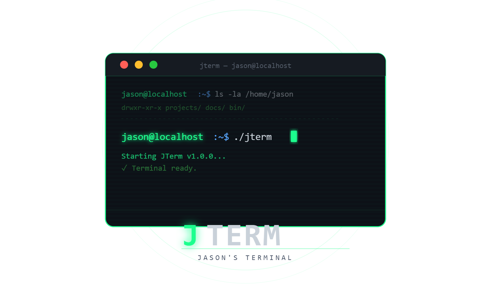

# JTerm



JTerm (Jason's Terminal) is a Qt6 split-pane terminal emulator focused on fast keyboard workflows, workspace layouts, and practical terminal automation.

It uses QTermWidget for real terminal behavior, adds a modern pane-and-tab workflow, and includes optional built-in LLM assistance for shell tasks.

## Why JTerm

- Real terminal backend, not a fake terminal simulation.
- Split panes and tabs that can be reshaped quickly.
- Save/load/edit layout JSON, including startup scripts and focused pane restoration.
- Built-in safeguards for risky actions (close confirmations, startup command warnings).
- Optional LLM shell helper (Ollama or OpenAI-compatible endpoints).

## Highlights

### Workspace And Panes

- Horizontal and vertical pane splitting.
- Nested split trees for complex arrangements.
- Tabbed workspaces with rename support.
- Pane rename, close, move-to-new-tab, and auto-arrange.
- Browser-style + tab button on the tab row.
- Pane header indicators:
  - ⚡ pane has startup commands
  - ◎ broadcast target
  - ↗ move pane to a new tab

### Safety And Session Flow

- Optional confirmation when exiting with multiple panes/tabs.
- Warn before loading layouts that include startup commands.
- Running-process close warnings for pane/tab/app close.
- Optional auto-save and restore of workspace layout on next launch.

### Layout Power

- Save current layout to JSON.
- Load layout JSON from UI or CLI.
- In-app JSON editor with validation and formatting.
- Startup script editing per pane.
- Focus persistence via current pane and current tab IDs.

### Broadcast Mode

- Mark one pane as Broadcast Source from the pane context menu.
- Mark one or more panes as Broadcast Target using header glyph checkboxes.
- Keystrokes in source pane are echoed to selected targets.
- Optional settings override to force broadcast-all targets.

### LLM Shell Helper

- Non-modal chat window so terminals stay interactive.
- Markdown-rendered streaming responses.
- Enter sends, Shift+Enter inserts newline.
- Quick copy actions for transcript and last reply.
- LLM providers:
  - Ollama
  - OpenAI-compatible API endpoints
- Built-in LLM settings verification in Preferences.

## Build Requirements

- g++ with C++20 support
- make
- pkg-config
- Qt6 dev libraries:
  - Qt6Core
  - Qt6Gui
  - Qt6Widgets
  - Qt6Network
- QTermWidget dev package
- Qt moc (moc or moc-qt6)

## Ubuntu Setup

```bash
sudo apt update
sudo apt install -y build-essential make pkg-config qt6-base-dev qt6-base-dev-tools libqtermwidget6-2-dev
```

Depending on distro version, QTermWidget package may be named libqtermwidget6-dev.

If runtime errors mention utf8proc:

```bash
sudo apt install -y libutf8proc3
```

Optional desktop integration extras:

```bash
sudo apt install -y qdbus-qt6 qt6-gtk-platformtheme qt6-wayland
```

## Build And Run

```bash
make
./jterm
```

On Windows (MinGW), executable is jterm.exe.

## Command Line Usage

### Start With Layout

```bash
./jterm --layout ./layout.json
```

### Send Command To Running Instance

By pane ID:

```bash
./jterm --send "ls -la" --pane-id 3
```

By pane title:

```bash
./jterm --send "pwd" --pane-title "Logs"
```

### Encode Startup Script For JSON

```bash
./jterm --encode-startup-script ./startup.sh
```

## Menus And Useful Shortcuts

- LLM chat: Ctrl+Shift+L
- Toggle menu bar: Ctrl+Shift+M
- New tab: Ctrl+T
- Close tab: Ctrl+W
- Split horizontally: Ctrl+Shift+H
- Split vertically: Ctrl+Shift+V
- Rename pane: Ctrl+Shift+R
- Auto-arrange panes: Ctrl+Shift+A
- Preferences: Ctrl+,

## Configuration And Data

JTerm uses QSettings for app preferences and stores auto-saved layout snapshots in the user config area.

- Auto-save layout snapshot path uses AppConfigLocation plus:
  - jterm/layout-autosave.json

On Linux this typically resolves under ~/.config.

## Layout JSON Reference

Top-level fields:

- version
- currentTabId (optional)
- currentPaneId (optional)
- tabs (array)

Each tab object:

- id
- title
- root

Node types:

- pane
  - id
  - title
  - startupScriptBase64 (optional)
- splitter
  - orientation (horizontal or vertical)
  - sizes
  - children

When currentPaneId is present, JTerm restores focus to that pane and switches to the tab containing it.

## License

MIT. See LICENSE.
